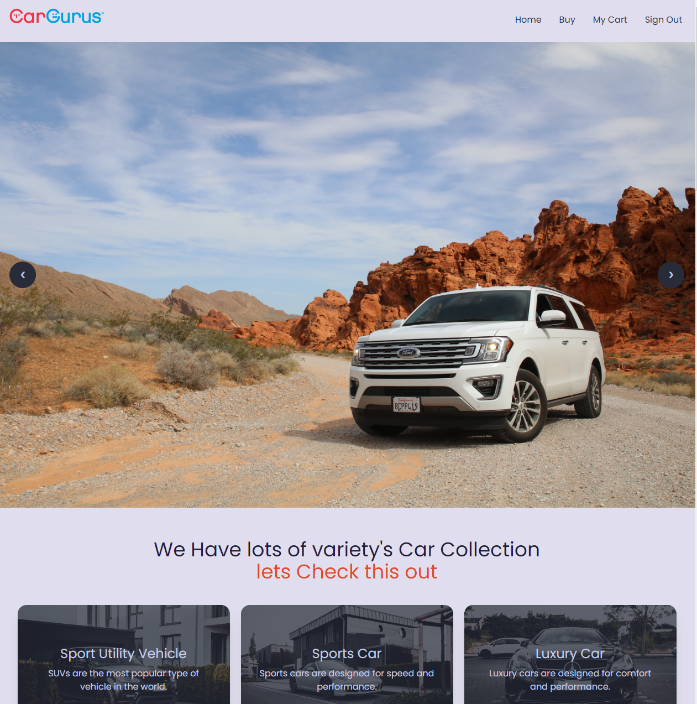
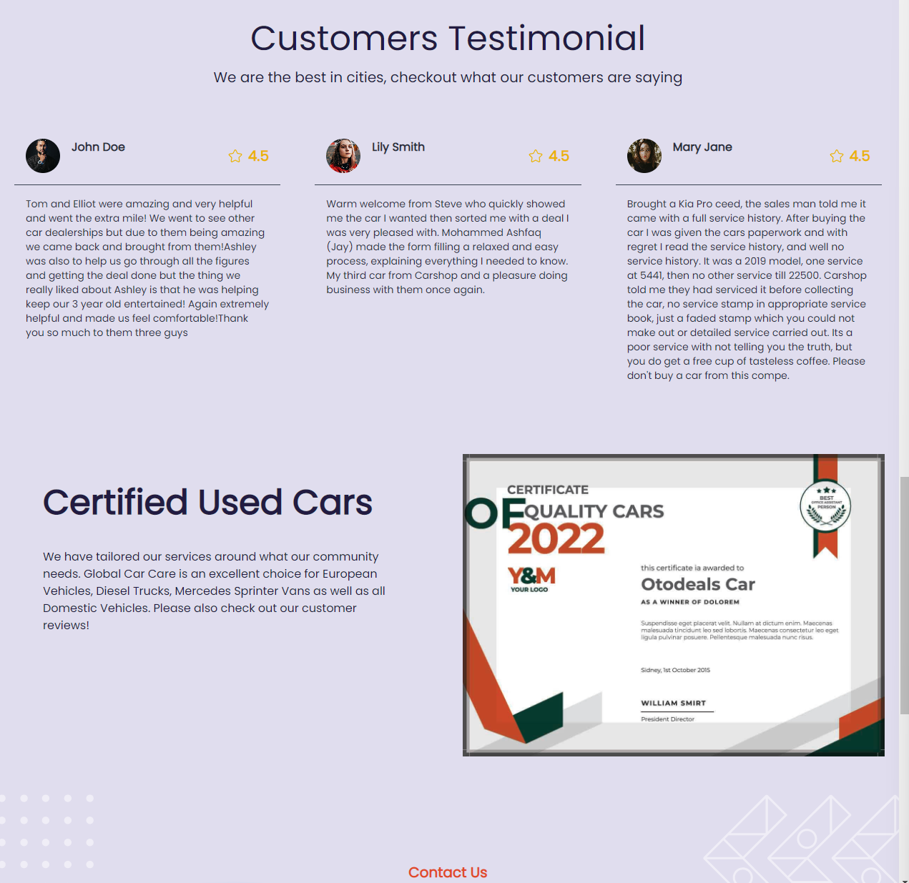

### This is a react based Web Application.

### A Car Selling Website - [Live Website](https://car-gurus-d0368.web.app) | [Client Side](https://github.com/arefinnuman/car-gurus-client-side) | [Server Side](https://github.com/arefinnuman/car-gurus-server-side)

- Features like Admin, Buyer & Seller Dashboard.
- Users can create accounts and log in to this website using their Google credentials.
- Users can place orders and view the order list they have generated

**Technologies:** React Js, Firebase, Tailwind CSS, Daisy UI, React Router Dom, React Hooks, MongoDB, NodeJS, Express Js

---

**Admin Info\**

email: admin@mail.com

password: Az258@65

